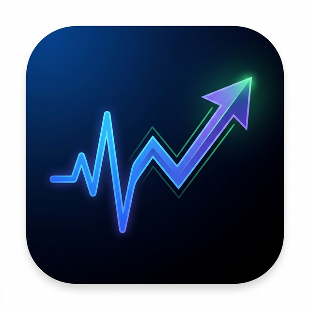

# WealthPulse AI 📊

<p align="center">
  
</p>

<p align="center">
  <strong>Modern Finansal Varlık Yönetim Platformu</strong>
</p>

<p align="center">
  <a href="#özellikler">Özellikler</a> •
  <a href="#kurulum">Kurulum</a> •
  <a href="#ekran-görüntüleri">Ekran Görüntüleri</a> •
  <a href="#teknoloji-yığını">Teknoloji</a> •
  <a href="#lisans">Lisans</a>
</p>

---

## ⚠️ Yasal Uyarı

> **Bu uygulama YATIRIM TAVSİYESİ DEĞİLDİR.**
> Sunulan veriler yalnızca bilgilendirme amaçlıdır.
> Yatırım kararlarınızı profesyonel danışmanlık almadan vermeyiniz.
> Geliştirici, bu uygulamayı kullanarak yapılan yatırımlardan kaynaklanan kayıplardan sorumlu tutulamaz.

---

## ✨ Özellikler

### 📈 Canlı Piyasa Verileri
- **BIST Hisseleri**: THYAO, ASELS, GARAN, AKBNK, SISE ve daha fazlası (Yahoo Finance API)
- **ABD Hisseleri**: AAPL, MSFT, GOOGL, AMZN, NVDA, META, TSLA (Yahoo Finance API)
- **ETF'ler**: SPY, QQQ, VOO, VTI, IWM (Yahoo Finance API)
- **Altın Fiyatları**: Kuyumcular Odası'ndan canlı veriler (Gram, Çeyrek, Yarım, Cumhuriyet, 22 Ayar Bilezik)
- **Döviz Kurları**: USD/TRY, EUR/TRY, GBP/TRY, CHF/TRY (Truncgil API)
- **Kripto Paralar**: BTC, ETH, BNB, SOL, XRP (CoinGecko API)

### 💼 Portföy Yönetimi
- Varlık ekleme (hisse, ETF, altın, döviz, kripto)
- **Altın eklerken otomatik güncel fiyat çekme** (Kuyumcular Odası)
- Kar/Zarar takibi ve ağırlık yüzdesi
- Varlık silme özelliği

### 💰 Gelir / Gider Takibi
- 15+ gider kategorisi (fatura, market, eğitim, kıyafet, ulaşım, sağlık vs.)
- 10+ gelir kategorisi (maaş, kira, fon geliri, freelance, temettü vs.)
- Pasta grafiklerle dağılım analizi
- İşlem geçmişi tablosu

### 📰 Ekonomi Haberleri
- Google News RSS'den canlı Türk ekonomi haberleri
- Kategori filtreleri: Ekonomi, Borsa, Döviz, Kripto, Altın
- Kaynak ve zaman bilgisi

### 🎲 Monte Carlo Simülasyonu
- Portföy büyüme tahmini
- Parametre ayarlanabilir simulasyonlar
- Görsel grafik sonuçları

### 📊 Dashboard
- KPI özet kartları
- Portföy performans grafikleri
- Son işlemler tablosu

---

## 📥 Kurulum

### Linux (.deb)
```bash
sudo dpkg -i WealthPulseAI-1.0.0-x64.deb
```

### Linux (AppImage)
```bash
chmod +x WealthPulseAI-1.0.0-x64.AppImage
./WealthPulseAI-1.0.0-x64.AppImage
```

### Geliştirici Kurulumu
```bash
git clone https://github.com/kaptanoguz/WealthPulseAI.git
cd WealthPulseAI
npm install
npm run dev
```

---

## 🛠 Teknoloji Yığını

| Teknoloji | Kullanım |
|-----------|----------|
| **Next.js 16** | App Router, SSR |
| **React 19** | UI Framework |
| **TypeScript** | Type Safety |
| **Mantine UI 8** | Component Library |
| **Recharts** | Grafikler |
| **Electron** | Masaüstü App |
| **Yahoo Finance 2** | BIST/US/ETF Verileri |
| **CoinGecko API** | Kripto Verileri |
| **Truncgil API** | Döviz & Altın Verileri |
| **Google News RSS** | Ekonomi Haberleri |

---

## 📸 Ekran Görüntüleri

### Dashboard
Modern fintech tasarımlı dashboard sayfası.

### Piyasalar
Canlı piyasa verileri — BIST, ABD Hisseleri, ETF'ler, Altın, Döviz, Kripto.

### Portföy
Detaylı portföy yönetimi ve altın ekleme.

### Gelir/Gider
Kategori bazlı gelir-gider takibi.

### Haberler
Güncel ekonomi haberleri.

---

## 🤝 Katkıda Bulunma

1. Fork yapın
2. Feature branch oluşturun (`git checkout -b feature/amazing-feature`)
3. Commit yapın (`git commit -m 'Add some amazing feature'`)
4. Branch'e push edin (`git push origin feature/amazing-feature`)
5. Pull Request açın

---

## 📄 Lisans

MIT Lisansı — Detaylar için [LICENSE](LICENSE) dosyasına bakınız.

---

<p align="center">
  Made with ❤️ in Turkey
</p>
